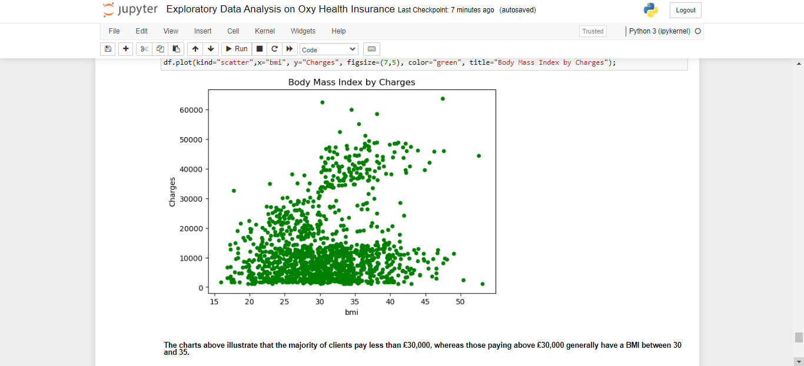

## OXY Health Insurance EDA 

#### Oxy Health Insurance Company Exploratory Data Analysis (EDA)! This repository contains an in-depth analysis of Oxy health insurance dataset, providing valuable insights into various factors affecting insurance charges.

#### Exploratory Data Analysis (EDA): Dive into comprehensive data exploration, including data cleaning, feature analysis, and statistical summaries, uncovering patterns, trends, and relationships.
#### Visualizations: Discover the power of data visualization! We showcase two comparison visuals. First, matplotlib alone presents clear insights. Second, the combination of matplotlib with seaborn enhances the visuals, highlighting data distributions, correlations, and patterns more effectively.
#### Join me on this insightful journey into Oxy health insurance data, leveraging Python's data analysis tools to make informed decisions and drive improvements in insurance services. Let's explore the data together! 🚀🔍

 

 

 
